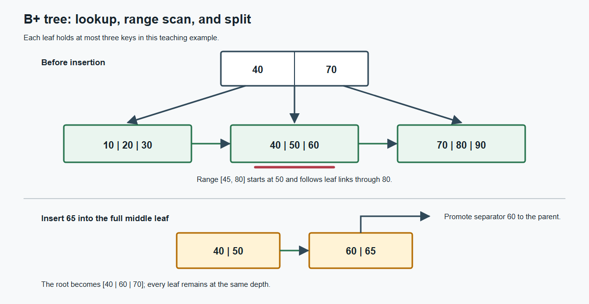

# Chapter 14: Indexing

## Core Question

How can an index provide a different access path without changing query results, and what
evidence is needed before recommending one for a workload?

Use this guide with `student_lab.sql` and `bplus_tree_example.png`.

## Scope and Connection

Chapter 7 improved logical design. An index is a physical structure; it does not repair
update, insertion, or deletion anomalies. Chapters 15 and 16 place indexes inside query
plans and optimizer decisions.

The classroom core is index purpose, B+ tree equality and range access, composite-column
order, covering indexes, and before-and-after query-plan evidence. Dense and sparse
indexes, clustering, splits, and hashing are conceptual extensions.

## Teaching Summary

| Topic | Worked example and practice | Evidence to retain |
|---|---|---|
| Search keys and workload evidence | Customer and date predicates | Query-to-index reason |
| B+ tree access | Equality and range traversal | Visited path and boundary decision |
| Composite and covering indexes | Leading-column and selected-column cases | Supported and unsupported queries |
| Plan verification | Before-and-after SQLite plans | Plan output and bounded conclusion |

## Prerequisites

- Primary, candidate, and foreign keys.
- Selection, range predicates, joins, and `ORDER BY`.
- `CREATE TABLE`, `CREATE INDEX`, and basic aggregate queries.

## Learning Objectives

After completing this chapter, you should be able to:

1. Distinguish a search key from a primary or candidate key.
2. Evaluate an index through access type, expected matches, updates, and storage cost.
3. Trace equality and range access in a simplified B+ tree.
4. Explain the leading-column effect in a composite index.
5. Explain a covering index and its maintenance cost.
6. Use `EXPLAIN QUERY PLAN` to verify an access-path hypothesis.
7. State what the observed plan does and does not prove.

## 1. Index and Search Key

An index is an additional data structure connecting search-key values to records or
record locations. A search key may contain one or more attributes and need not be unique.
A primary key is a logical uniqueness constraint. An index is a physical access path.

For `Enrollment(student_id, course_id, grade)`, the primary key may be
`(student_id, course_id)`. An index on grade supports grade lookup even though many rows
may share the same grade.

### Practice

For `Course(course_id, title, dept_code)`, explain the roles of `course_id` as a primary
key and `dept_code` as an index search key. Department code permits duplicates.

## 2. Workload Evidence

Index evaluation should consider:

- equality, range, prefix, ordering, and join access;
- expected matching rows and access frequency;
- insertion, deletion, and indexed-value update cost;
- index storage;
- the complete workload rather than one isolated query.

### Worked Example

Suppose a registration system performs hundreds of daily lookups for one student's
enrollments and one batch insertion. An index beginning with `student_id` has a plausible
benefit because the frequent equality query retrieves few rows. The claim still requires
row-count and plan evidence.

Compare that workload with one dominated by grade updates and very few grade lookups.
The second case may not justify a grade index because maintenance is frequent and lookup
benefit is rare.

## 3. B+ Tree Access

A B+ tree is a balanced ordered index. Internal nodes contain separator keys and child
pointers. Leaves contain search-key entries and record references, and adjacent leaves
are linked in order. Every root-to-leaf path has the same length.



The figure is a teaching abstraction, not a claim about SQLite's private page format.

### Equality Lookup

To find 50:

1. Compare 50 with root separators 40 and 70.
2. Follow the middle child for `40 <= key < 70`.
3. Find 50 in the leaf and follow its record reference.

### Range Lookup

For `45 <= key <= 80`, descend once to the first qualifying leaf, output 50 and 60, follow
the leaf link to 70 and 80, and stop at 90. Linked ordered leaves avoid restarting from
the root for every value.

### Predict and Check

Trace keys 25, 65, and 100. For range `[25,75]`, the output is 30, 40, 50, 60, and 70;
encountering 80 establishes the stop condition.

## 4. Composite Indexes

A composite index `(A, B)` is ordered first by A and then by B within equal A values. It
normally supports `A = value` and `A = value AND B range` efficiently. A predicate on B
alone does not provide the same leading ordered range.

```sql
SELECT ordered_at, amount
FROM ch14_order_line
WHERE customer_id = 'C0042'
  AND ordered_at BETWEEN '2026-01-01' AND '2026-12-31'
ORDER BY ordered_at;
```

`(customer_id, ordered_at)` groups one customer's rows and orders them by date. Reversing
the columns primarily groups all rows by date.

### Practice

For `(dept_code, salary)`, reason about:

```text
A. dept_code = 'IM'
B. dept_code = 'IM' AND salary BETWEEN 50000 AND 70000
C. salary = 60000
D. dept_code < 'IM' AND salary = 60000
```

A uses the first component. B uses equality on the first and a range on the second. C
lacks the leading component. In D, the first component is already a range, so the second
does not form one simple continuous search interval. An actual DBMS may have additional
techniques, so inspect the plan.

## 5. Covering Index

An index covers a query when it contains every column required for filtering and output,
allowing the DBMS to avoid a separate table lookup.

The lab first uses `(customer_id, ordered_at)`. The query also returns amount, so a table
lookup may remain. After adding amount, SQLite 3.45.3 reports a covering index for the
supplied query.

Adding columns increases index size, reduces fanout, and increases write cost. If the
report also returns status, the existing index no longer covers it. Do not add status
before considering report frequency and update workload.

## 6. Query-Plan Lab

The lab creates 20,000 reproducible rows and observes:

1. a scan without a secondary index;
2. an index search using `(customer_id, ordered_at)`;
3. a covering search after amount is included;
4. plans for a missing leading predicate and a low-selectivity status predicate.

```sql
CREATE INDEX idx_name ON table_name (column1, column2);
DROP INDEX idx_name;
EXPLAIN QUERY PLAN SELECT ...;
```

Before each phase, predict `SCAN` or `SEARCH`, the useful predicate, and whether the index
covers the output. Then retain:

- the complete plan;
- the index name;
- displayed predicate bounds;
- the query result;
- SQLite version and statistics state.

In the verified environment, the first phase scans, the composite-index phase searches
by customer and date, and the final phase reports a covering index. A plan difference in
another version is evidence to investigate, not text to overwrite.

The high-frequency status `COMPLETE` matches most rows. Even if a status index exists, the
optimizer may reasonably prefer a scan.

## Conceptual Extensions

- **Clustering index:** record order follows the search-key order.
- **Secondary index:** index order differs from record order.
- **Dense index:** has an entry for every search-key value.
- **Sparse index:** has entries for selected values and requires compatible record order.
- **B+ tree split:** an overflowing node divides and sends a separator upward while all
  leaves remain at one depth.
- **Hash index:** can support equality lookup but does not retain key order for a range.

Complete B+ tree insertion/deletion algorithms and cost derivations are not classroom
core requirements.

## Common Errors

1. Assuming that a search key is unique.
2. Claiming that an index changes query results or repairs normalization.
3. Indexing every column without considering writes and storage.
4. Ignoring composite-column order.
5. Comparing one timing without checking plans and cache conditions.
6. Treating successful `CREATE INDEX` as proof that a query used the index.
7. Treating the textbook B+ tree drawing as a DBMS page-layout specification.

## Classroom and Individual Evidence

Propose at most two indexes for three supplied queries. State the query-to-index reason,
unsupported query, and write/storage cost. Compare plans after the proposal is fixed.

Retain the original proposal, three plans, revised proposal, and one statement that the
current evidence cannot support. Peer ranking does not directly determine the grade.

## Chapter Summary

Index selection starts from workload evidence. B+ trees support ordered equality and
range access, composite order controls useful leading predicates, and covering can avoid
a table lookup at additional maintenance cost. Chapter 15 places these access paths in a
complete query-processing plan.

## After-Class Continuation

Inspect one additional query plan before and after creating a justified index. Retain the
query, index definition, both plans, and a brief statement about the write or storage cost
that the plan output does not measure.
